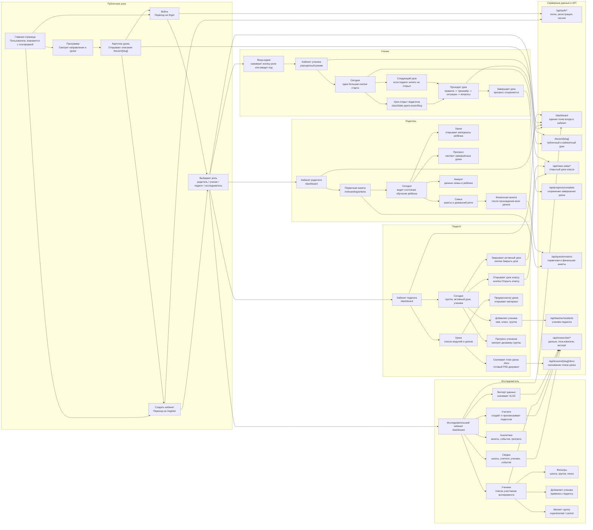
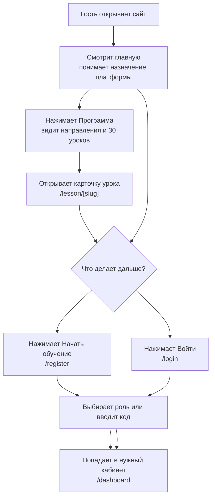
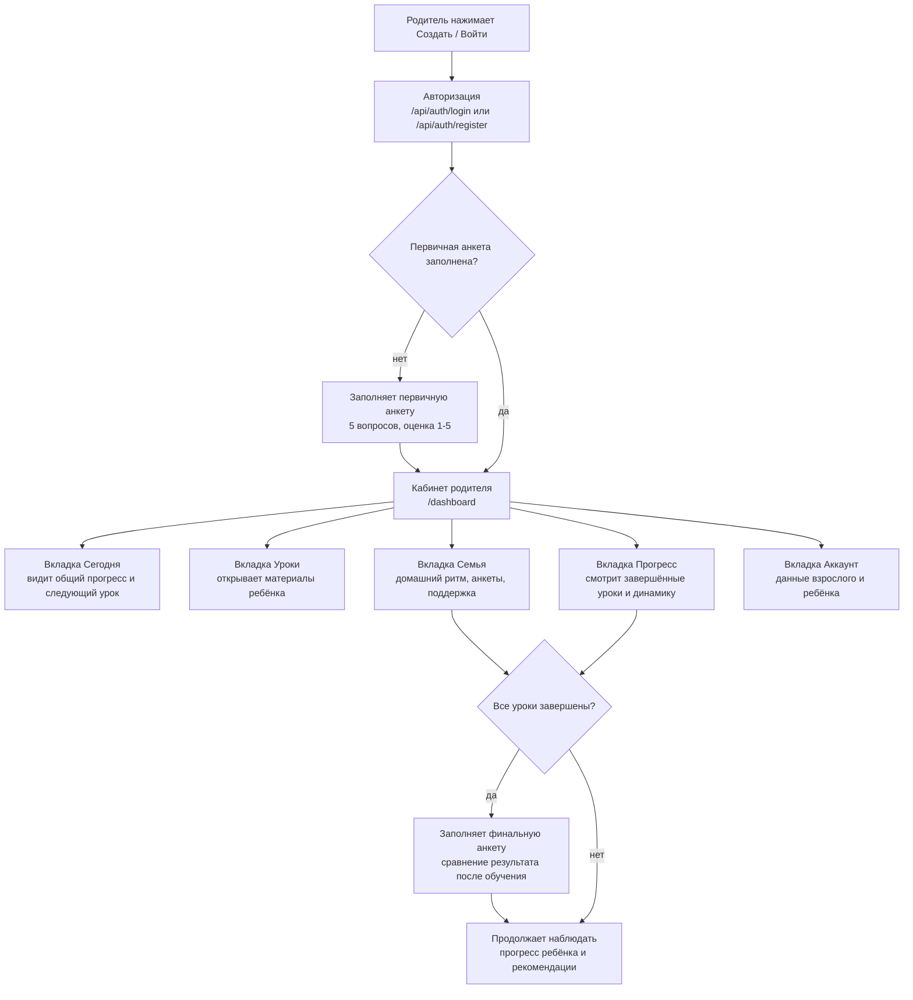
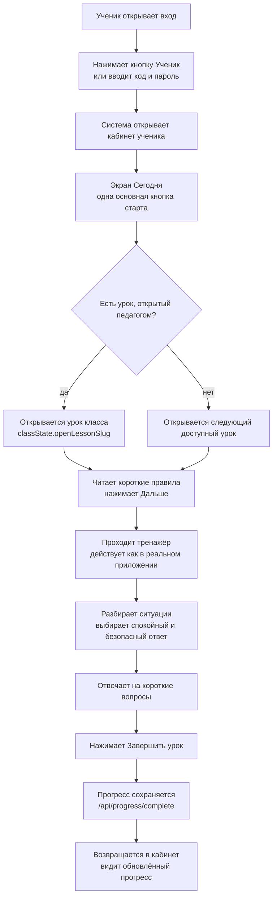
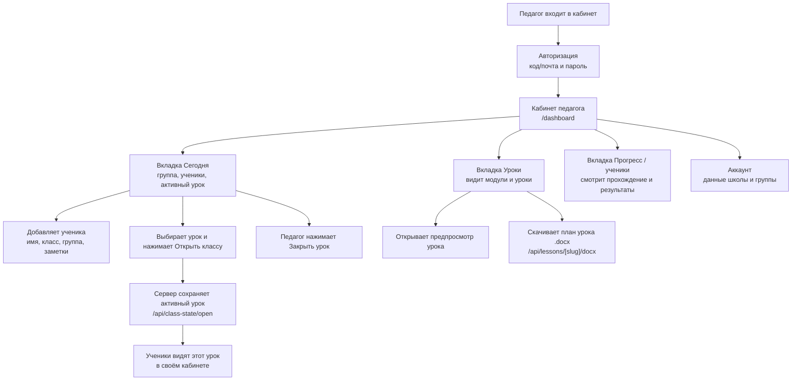
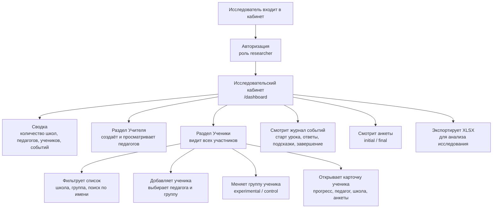
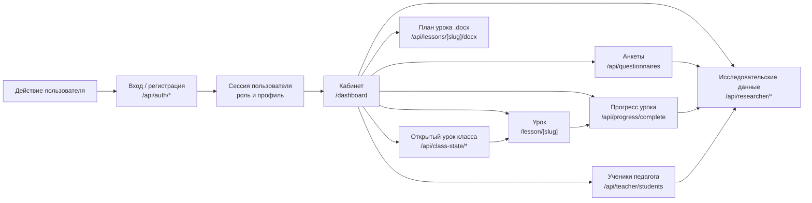

# Карта пользовательских путей UQUVLI.UZ

Готовый материал для презентации: ниже есть одна общая карта платформы и отдельные подробные карты для каждой роли. Mermaid-код можно вставить в Notion, Obsidian, GitHub Markdown, Markdown Preview Mermaid Support, Mermaid Live Editor или экспортировать в PNG/SVG.

## Общая карта платформы

## Детальная карта: гость

## Детальная карта: родитель

## Детальная карта: ученик

## Детальная карта: педагог

## Детальная карта: исследователь

## Карта данных и серверных взаимодействий

## Проверка по проекту

- Роли соответствуют типу `UserRole`: `student`, `parent`, `teacher`, `researcher`.
- Основные маршруты соответствуют `src/app`: `/`, `/program`, `/lesson/[slug]`, `/login`, `/register`, `/onboarding/anketa`, `/dashboard`.
- Родительский путь учитывает обязательную первичную анкету перед кабинетом.
- Ученический путь учитывает урок, открытый педагогом через `classState.openLessonSlug`, и fallback на следующий урок.
- Педагогический путь включает добавление учеников, открытие/закрытие урока классу и скачивание `.docx`.
- Исследовательский путь включает учителей, учеников, фильтры, группы `experimental/control`, анкеты, события, прогресс и экспорт.
